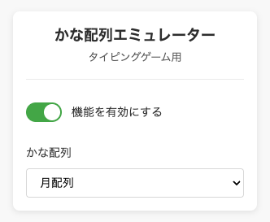
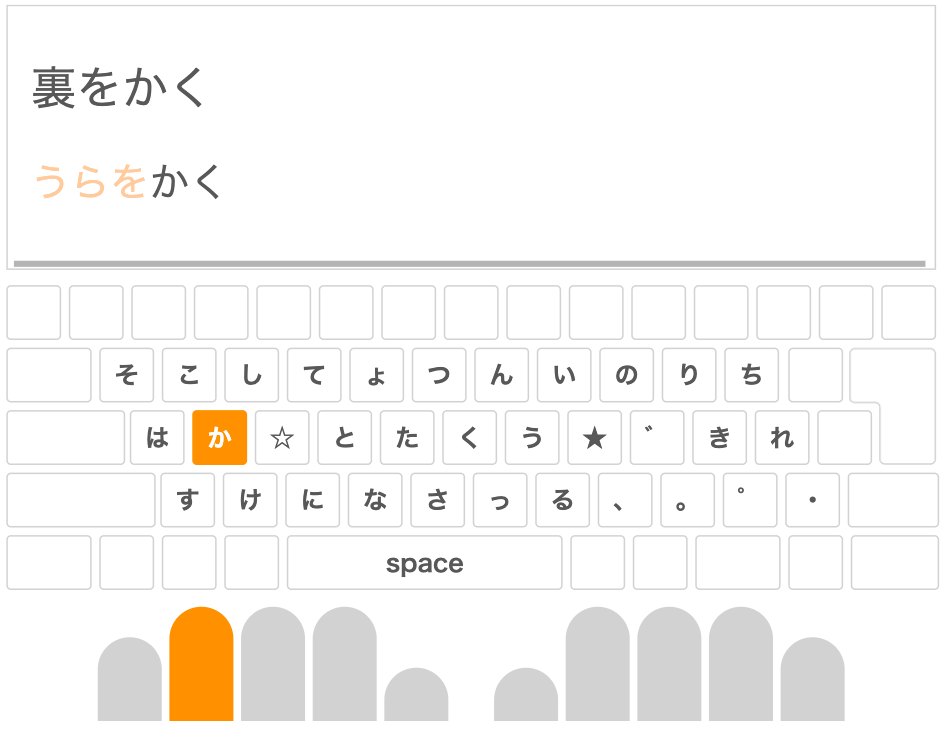

  

# Kana Layout Extension

タイピングゲームを様々なかな入力配列でプレイするための、Chrome拡張機能です。

## 使い方

以下のページからインストールできます。

<https://chromewebstore.google.com/detail/kana-layout-extension/ojfbppdppiaflmgfpjjkfggdobdpgifp>

インストール後、アイコンをクリックするとポップアップが表示されます。ポップアップでは、機能の有効/無効の切り替えと、配列の選択ができます。

⚠️この拡張機能では、デフォルトのキーボードイベントを上書きしてかな配列のエミュレートを実現しています。そのため、検索フォームなどに文字を入力する場合は、一時的に拡張機能をオフにしてください。

## 対応しているサイト

e-typing、タイピング速度検定、Typing Tube、YTypingに対応しています。

e-typingでは使用している配列のキーガイドを確認することができます。

## 対応している配列

現在は月配列に対応しています。これからは[かな配列テスター](https://mentaiko.syoyu.net/)を参考に、月配列系の配列や、その他メジャーなかな配列を追加していきます。

次は新JIS配列と月林檎配列を追加する予定です。

## ブラウザ対応状況

以下のOS、ブラウザで動作確認をしています。

- Mac / Chrome
- Windows / Chrome

## 問題点・要望等について

不具合や要望等あれば、GitHubのIssueまたは、Twitterで教えてください。

- GitHub Issue: <https://github.com/tekihei2317/kana-layout-extension/issues>
- Twitter: <https://x.com/tekihei2317_>
