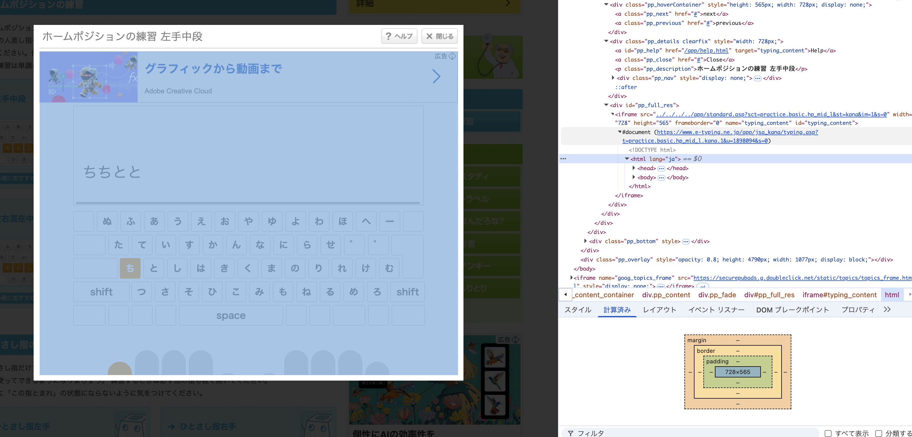

# メモ

## キーボードイベントの発火について

とりあえずcontent.jsに以下のようなコードを書いてみる。fは月配列で「と」なのんで、JISかなで「と」になるsに変換している。

```js
console.log("Kana Layout Extension loaded");

function handleKeyDown(event) {
  console.log("Key pressed:", event.key);

  // f→sに変換する
  if (event.key === "f") {
    event.preventDefault();

    const mappedEvent = new KeyboardEvent("keydown", {
      key: "s",
    });
    document.dispatchEvent(mappedEvent);
  }
}

// ページに状態表示用の要素を追加
document.addEventListener("keydown", handleKeyDown, true);
```

コンソールに以下を書いて、どういう挙動になっているか確認する。

```js
document.addEventListener("keydown", (event) => console.log(event.key));
```

asdfを順番に押すと次のようになった。

```text
Key pressed: a
VM385:1 a
content.js:4 Key pressed: s
VM385:1 s
content.js:4 Key pressed: d
VM385:1 d
content.js:4 Key pressed: f
content.js:4 Key pressed: s
VM385:1 s
VM385:1 f
```

sのを押したイベントを発火できているが、fを押したイベントを止められていない。

event.stopPropagationとevent.stopImmediatePropagationを実行するとうまくいった。

```js
event.stopPropagation();
event.stopImmediatePropagation();
```

```text
Key pressed: a
VM410:1 a
content.js:4 Key pressed: s
VM410:1 s
content.js:4 Key pressed: d
VM410:1 d
content.js:4 Key pressed: f
content.js:4 Key pressed: s
VM410:1 s
```

## e-typingでのキー入力の判定について

e-typingのプレイ画面のポップアップウィンドウにフォーカスしてキーを押すと、コンソールに拡張機能のログが出なくなる。これはなぜだろう。



iframeを使っているからっぽい。とりあえずiframeを直接開いてやってみることにしよう。
